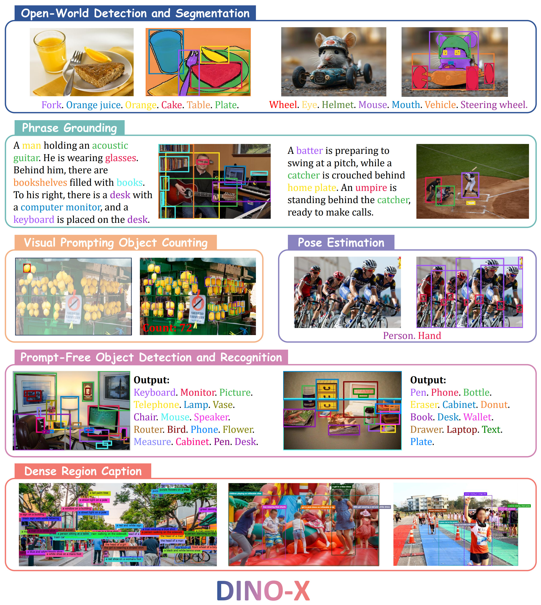

<h1 align="center">DINO-X: A Unified Vision Model for Open-World Object Detection and Understanding</h1>

  **The World's Top-Performing Vision Model for Open-World Object Detection** 

  The project provides **examples** for using **DINO-X**, which are hosted on [DeepDataSpace](https://deepdataspace.com/home).

  **[IDEA Research](https://github.com/IDEA-Research)** 

  

## DINO-X Highlights

Beyond [Grounding DINO 1.5](https://github.com/IDEA-Research/Grounding-DINO-1.5-API), DINO-X has several improvements, taking a step forward towards becoming a more general object-centric vision model. The highlights of the DINO-X are as follows:

✨ **The Strongest Open-Set Detection Performance**: DINO-X Pro set new SOTA results on zero-shot transfer detection benchmarks: **56.0 AP** on COCO, **59.8 AP** on LVIS-minival and **52.4 AP** on LVIS-val. Notably, Notably, it scores **63.3 AP** and **56.5 AP** on the rare classes of LVIS-minival and LVIS-val benchmarks, improving the previous SOTA performance by 5.8 box AP and 5.0 box AP. Such a result underscores its significantly improved capacity for recognizing long-tailed objects. 

🔥 **Diverse Input Prompt and Multi-level Output Semantic Representations**: DINO-X can accept text prompts, visual prompts, and customized prompts as input, and it outputs representations at various semantic levels, including bounding boxes, segmentation masks, pose keypoints, and object captions, with multiple perception heads.

🍉 **Rich and Practical Capabilities**: DDINO-X can simultaneously support lots of highly practical tasks, including Open-Set Object Detection and Segmentation, Phrase Grounding, Visual-Prompt Counting, Pose Estimation,and Region Captioning. We further develop a universal object prompt to achieve *Prompt-Free* Anything Detection and Recognition.

## TODO
- [ ] Refine project documentation  
- [ ] Release API code and Gradio demo

## Contents

- [Model Framework](#model-framework)
- [Model Performance](#performance-of-dino-x)

## Model Framework

We present the overall framework of DINO-X in the following image: DINO-X can accept text prompts, visual prompts, and customized prompts as input, and it can generate representations at various semantic levels, including bounding boxes, segmentation masks, pose keypoints, and object captions.

  

## Performance of DINO-X

DINO-X shows a significant performance improvement compared to previous state-of-the-art methods. As shown in Table 1, DINO-X achieves 56.0 box AP on COCO detection benchmark.On the LVIS-minival and LVIS-val benchmarks, DINO-X Pro achieves 59.8 box AP and 52.4 box AP, respectively, surpassing the previously best-performing Grounding DINO 1.6 Pro model by 2.0 AP and 1.1 AP, respectively. Notably, for the detection performance on LVIS rare classes, DINO-X achieves 63.3 AP on LVIS-minival and 56.5 AP on LVIS-val, significantly surpassing the previous SOTA Grounding DINO 1.6 Pro model by 5.8 AP and 5.0 AP, respectively, demonstrating the exceptional capability of DINO-X in long-tailed object detection scenarios.

  

