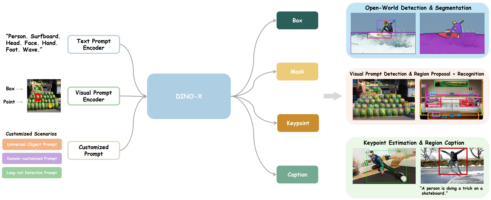
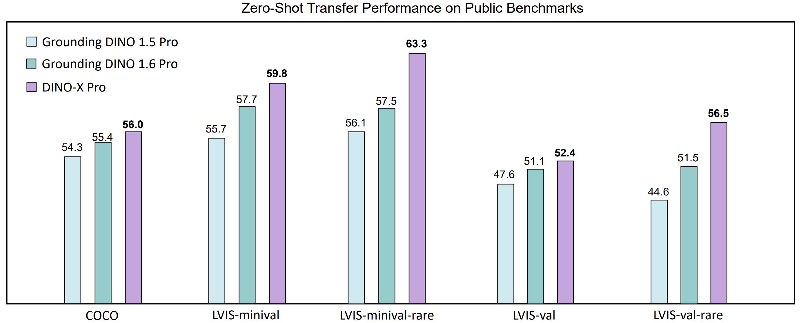
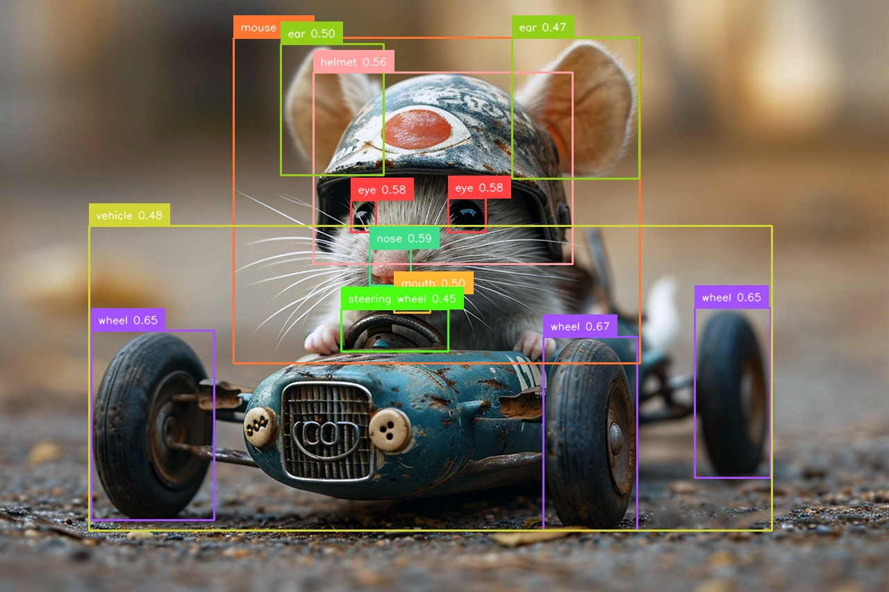
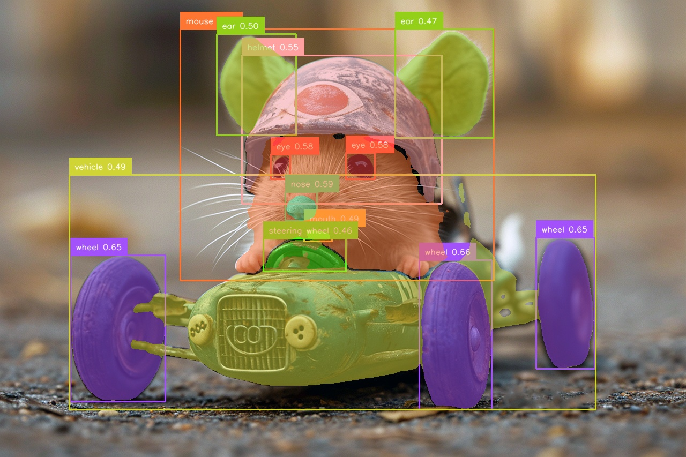
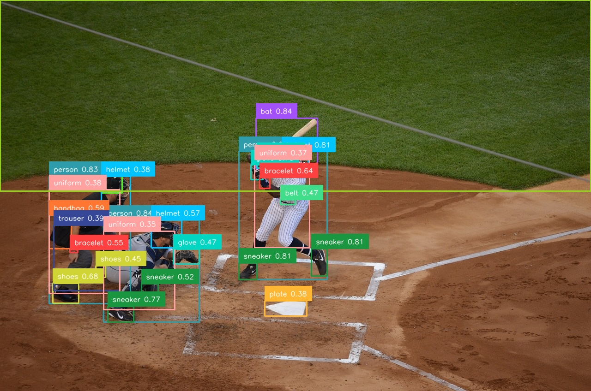
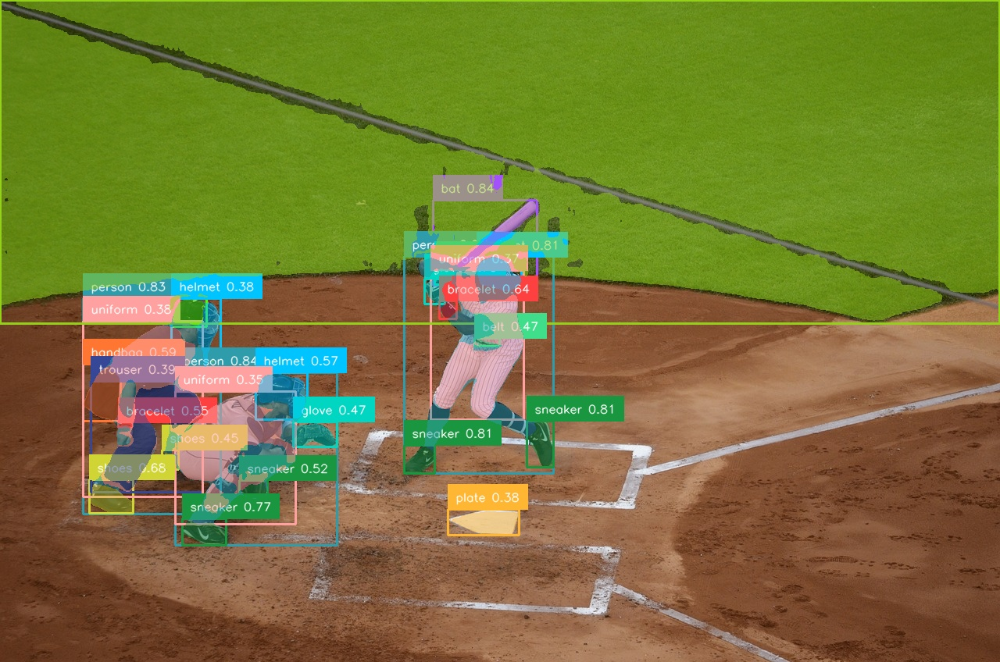

<h1 align="center">DINO-X: A Unified Vision Model for Open-World Object Detection and Understanding</h1>

<div align=center>

  **The World's Top-Performing Vision Model for Open-World Object Detection** 

  The project provides **examples** for using **DINO-X**, which is hosted on [DeepDataSpace](https://deepdataspace.com/home).

  **[IDEA Research](https://github.com/IDEA-Research)** 

</div>

<div align=center>

[](https://arxiv.org/abs/2411.14347)   [](https://deepdataspace.com/home)
</div>

[](https://github.com/user-attachments/assets/7209d885-7401-4f9e-9ed1-899eb4bd12b1)

## Highlights

Beyond [Grounding DINO 1.5](https://github.com/IDEA-Research/Grounding-DINO-1.5-API), DINO-X has several improvements, taking a step forward towards becoming a more general object-centric vision model. The highlights of the DINO-X are as follows:

✨ **The Strongest Open-Set Detection Performance**: DINO-X Pro set new SOTA results on zero-shot transfer detection benchmarks: **56.0 AP** on COCO, **59.8 AP** on LVIS-minival and **52.4 AP** on LVIS-val. Notably, it scores **63.3 AP** and **56.5 AP** on the rare classes of LVIS-minival and LVIS-val benchmarks, improving the previous SOTA performance by 5.8 box AP and 5.0 box AP. Such a result underscores its significantly enhanced capacity for recognizing long-tailed objects. 

🔥 **Diverse Input Prompt and Multi-level Output Semantic Representations**: DINO-X can accept text prompts, visual prompts, and customized prompts as input, and it outputs representations at various semantic levels, including bounding boxes, segmentation masks, pose keypoints, and object captions, with multiple perception heads.

🍉 **Rich and Practical Capabilities**: DINO-X can simultaneously support lots of highly practical tasks, including Open-Set Object Detection and Segmentation, Phrase Grounding, Visual-Prompt Counting, Pose Estimation, and Region Captioning. We further develop a universal object prompt to achieve *Prompt-Free* Anything Detection and Recognition.

🔌 **Seamless AI Tool Integration**: With [DINO-X MCP Server](https://github.com/IDEA-Research/DINO-X-MCP), developers can integrate DINO-X's capabilities directly into Cursor, Claude, and other MCP-compatible AI tools, enabling object detection in conversational AI workflows.

## Latest News

- **2025.06.18**: 🚀 **DINO-X MCP Server** is now available! Integrate DINO-X into Cursor and other MCP-compatible tools. Check [dinox-mcp](https://github.com/IDEA-Research/DINO-X-MCP) for details.

- **2025.05.21**: For more demo usages, including `DINO-X`, `T-Rex`, `DINO-X-SeeK`, please check [dds-cloud-api examples](https://github.com/deepdataspace/dds-cloudapi-sdk/blob/main/examples.py) for more details.

- **2025.04.21**: Update to `dds-cloudapi-sdk` API V2 version. The V1 version in the original API for `DINO-X` has been deprecated, please update to the latest `dds-cloudapi-sdk` by `pip install dds-cloudapi-sdk -U` to use `DINO-X` model. Please refer to [dds-cloudapi-sdk](https://github.com/deepdataspace/dds-cloudapi-sdk) and our [API docs](https://cloud.deepdataspace.com/docs) to view more details about the update.

- **2025.03.11**: We have released [DINO-XSeeK](https://deepdataspace.com/blog/dino-xseek) model towards detecting objects based on more complex user descriptions. Please refer to [RexSeeK](https://github.com/IDEA-Research/RexSeek) for more details and the demo has already been available at [here](https://cloud.deepdataspace.com/playground/dino-x).

- **2025.01.18**: DINO-X achieves SOTA performance of 51.7 average mask AP score on [Segmentation in the Wild](https://eval.ai/web/challenges/challenge-page/1931/overview) zero-shot track.

- **2024.12.05**: Released the **Prompt-Free Anything Detection and Segmentation** feature. For API usage and demo visualization, please refer to [here](#prompt-free-anything-detection-and-segmentation). To use the latest features, please install `dds-cloudapi-sdk==0.3.3`.

- **2024.12.04**: Launched the **Open-World Detection and Segmentation** feature. For API usage and demo visualization, visit [here](#open-world-object-detection-and-segmentation).

- **2024.12.03**: Support **DINO-X with SAM 2** for **Open-World Anything Segmentation and Tracking**. For more details, check out the [Grounded SAM 2](https://github.com/IDEA-Research/Grounded-SAM-2?tab=readme-ov-file#grounded-sam-2-image-demo-with-dino-x) project.


## Contents

- [Model Framework](#model-framework)
- [Model Performance](#performance)
  - [Side-by-side Performance Comparison with Previous Best Methods](#side-by-side-performance-comparison-with-previous-best-methods)
  - [Zero-Shot Performance on Object Detection Benchmarks](#zero-shot-performance-on-object-detection-benchmarks)
  - [Zero-Shot Performance on Generic Segmentation Benchmarks](#zero-shot-performance-on-generic-segmentation-benchmarks)
- [API Usage](#api-usage)
  - [Installation](#installation)
  - [Registration](#register-on-offical-website-to-get-api-token)
  - [Support Demos](#run-local-api-demos)
    - [Open-World Detection and Segmentation](#open-world-object-detection-and-segmentation)
    - [Prompt-Free Anything Detection and Segmentation](#prompt-free-anything-detection-and-segmentation)
- [Related Works](#related-work)
- [BibTeX](#bibtex)

## Model Framework

DINO-X can accept `text prompts`, `visual prompts`, and `customized prompts` as input, and it can generate representations at various semantic levels, including bounding boxes, segmentation masks, pose keypoints, and object captions.

<div align="center">
  
</div>

## Performance

### Side-by-Side Performance Comparison with Previous Best Methods

<div align="center">
  
</div>

### Zero-Shot Performance on Object Detection Benchmarks

<table align="center">
<thead>
  <tr>
    <th>Model</th>
    <th>COCO <br><sup><sup>(AP box)</sup></sup></th>
    <th>LVIS-minival <br><sup><sup>(AP all)</sup></sup></th>
    <th>LVIS-minival <br><sup><sup>(AP rare)</sup></sup></th>
    <th>LVIS-val <br><sup><sup>(AP all)</sup></sup></th>
    <th>LVIS-val <br><sup><sup>(AP rare)</sup></sup></th>
  </tr>
</thead>
<tbody align="center">
  <tr>
    <td>Other Best<br>Open-Set Model</td>
    <td>53.4<br><sup><sup>(OmDet-Turbo)</sup></sup></td>
    <td>47.6<br><sup><sup>(T-Rex2 visual)</sup></sup></td>
    <td>45.4<br><sup><sup>(T-Rex2 visual)</sup></sup></td>
    <td>45.3<br><sup><sup>(T-Rex2 visual)</sup></sup></td>
    <td>43.8<br><sup><sup>(T-Rex2 visual)</sup></sup></td>
  </tr>
  <tr>
    <td>DetCLIPv3</td>
    <td> - </td>
    <td>48.8</td>
    <td>49.9</td>
    <td>41.4</td>
    <td>41.4</td>
  </tr>
  <tr>
    <td>Grounding DINO</td>
    <td>52.5</td>
    <td>27.4</td>
    <td>18.1</td>
    <td> - </td>
    <td> - </td>
  </tr>
  <tr>
    <td>T-Rex2 (text)</td>
    <td>52.2</td>
    <td>54.9</td>
    <td>49.2</td>
    <td> 45.8 </td>
    <td> 42.7 </td>
  </tr>
  <tr>
    <td>Grounding DINO 1.5 Pro</td>
    <td>54.3</td>
    <td>55.7</td>
    <td>56.1</td>
    <td>47.6</td>
    <td>44.6</td>
  </tr>
  <tr>
    <td>Grounding DINO 1.6 Pro</td>
    <td>55.4</td>
    <td>57.7</td>
    <td>57.5</td>
    <td>51.1</td>
    <td>51.5</td>
  </tr>
  <tr>
    <td><b>DINO-X Pro</b></td>
    <td><b>56.0</b></td>
    <td><b>59.7</b></td>
    <td><b>63.3</b></td>
    <td><b>52.4</b></td>
    <td><b>56.5</b></td>
  </tr>
</tbody>
</table>

- **Performance**: DINO-X Pro achieves **SOTA** performance on COCO, LVIS-minival, LVIS-val, **zero-shot** object detection benchmarks.
- **Effective Long-tail Object Detection**: DINO-X Pro has significantly improved the model's performance on LVIS-rare classes, significantly surpassing the previous SOTA Grounding DINO 1.6 Pro model by **5.8 AP** and **5.0 AP**, respectively, demonstrating the exceptional capability of DINO-X in **long-tailed** object detection scenarios.

### Zero-Shot Performance on Generic Segmentation Benchmarks

<table align="center">
<thead>
  <tr>
    <th>Model</th>
    <th>COCO <br><sup><sup>(AP mask)</sup></sup></th>
    <th>LVIS-minival <br><sup><sup>(AP mask)</sup></sup></th>
    <th>LVIS-minival <br><sup><sup>(AP mask rare)</sup></sup></th>
    <th>LVIS-val <br><sup><sup>(AP mask)</sup></sup></th>
    <th>LVIS-val <br><sup><sup>(AP mask rare)</sup></sup></th>
    <th>SGinW <br><sup><sup>(AP mask avg)</sup></sup></th>
  </tr>
</thead>
<tbody align="center">
  <tr>
      <td colspan="7" style="text-align:center;"> <em>Assembled General Perception Model</em> </td>
  </tr>
  <tr>
    <td>Grounded HQ-SAM <small>(Base + Huge)</small></td>
    <td>-</td>
    <td>-</td>
    <td>-</td>
    <td>-</td>
    <td>-</td>
    <td>49.6</td>
  </tr>
  <tr>
    <td>Grounded SAM <small>(1.5 Pro + Huge)</small></td>
    <td>44.3</td>
    <td>47.7</td>
    <td>50.2</td>
    <td>41.8</td>
    <td>46.0</td>
    <td> - </td>
  </tr>
  <tr>
    <td>Grounded SAM 2 <small>(1.5 Pro + Large)</small></td>
    <td> <b> 44.7 </b> </td>
    <td>46.2</td>
    <td>50.1</td>
    <td>40.5</td>
    <td>44.6</td>
    <td> - </td>
  </tr>
  <tr>
    <td> <b>DINO-X Pro + SAM-Huge</b> </td>
    <td>44.2</td>
    <td><b>51.2</b></td>
    <td><b>52.2</b></td>
    <td> - </td>
    <td> - </td>
    <td> - </td>
  </tr>
  <tr>
    <td colspan="7" style="text-align:center;"> <em>Unified Vision Model</em> </td>
  </tr>
  <tr>
    <td><b>DINO-X Pro</b> <small>(Mask Head)</small></td>
    <td>37.9</td>
    <td>43.8</td>
    <td>46.7</td>
    <td>38.5</td>
    <td>44.4</td>
    <td><b>51.7</b></td>
  </tr>
</tbody>
</table>

- **Performance**: DINO-X achieves SOTA performance of 51.7 average mask AP on [SGinW zero-shot benchmarks](https://eval.ai/web/challenges/challenge-page/1931/overview). And DINO-X also achieves mask AP scores of 37.9, 43.8, and 38.5 on the COCO, LVIS-minival, and LVIS-val **zero-shot** instance segmentation benchmarks, respectively.Compared to [Grounded SAM](https://github.com/IDEA-Research/Grounded-Segment-Anything) and [Grounded SAM 2](https://github.com/IDEA-Research/Grounded-SAM-2), there is still a notable performance gap for DINO-X to catch up. We will further optimize the segmentation performance in the future release.
- **Efficiency**: Unlike Grounded SAM series, DINO-X significantly improves the segmentation efficiency by generating corresponding masks for each region without requiring multiple complex inference steps.
- **Practical Usage**: Users can use the mask function of DINO-X based on their actual needs. If the users require simultaneously object segmentation and tracking, we recommend using the latest Grounded SAM 2 (DINO-X + SAM 2), which we have already implemented in [here](https://github.com/IDEA-Research/Grounded-SAM-2?tab=readme-ov-file#grounded-sam-2-video-object-tracking-demo-with-custom-video-input-with-dino-x).


## API Usage

### Installation

- Install the required packages

```bash
pip install -r requirements.txt
```

**Note:** If you encounter some errors with API, please install the latest version of `dds-cloudapi-sdk`:

```bash
pip install dds-cloudapi-sdk --upgrade
```

### Register on Offical Website to Get API Token

- **First-Time Application**: If you are interested in our project and wish to try our algorithm, you will need to apply for the corresponding API Token through our [request API token website](https://cloud.deepdataspace.com/apply-token?from=github) for your first attempt.

<!-- - **Request Additional Token Quotas**: If you find our project helpful and need more API token quotas, you can request additional tokens by [filling out this form](https://docs.google.com/forms/d/e/1FAIpQLSfjogAtkgoVyFX9wvCAE15mD7QtHdKdKOrVmcE5GT1xu-03Aw/viewform?usp=sf_link). Our team will review your request and allocate more tokens for your use in one or two days. You can also apply for more tokens by sending us an email. -->

- **Request Additional Token Quotas**: At this stage, we now support **WeChat Pay** as a payment channel. Users can purchase additional API calls through our [official platform](https://cloud.deepdataspace.com/dashboard/usage). If you encounter any issues during the purchase process or have other collaboration needs, feel free to contact us via this email address: **deepdataspace_dm@idea.edu.cn**.

### Run local API demos

#### Open-World Object Detection and Segmentation

Open-world detection means users can detect anything with text prompts, try this feature by setting your API token in [demo.py](./demo.py) and run local demo:

```bash
python demo.py
```

After running the local demo, the annotated image will be saved at: `./outputs/open_world_detection`

<details>
<summary> Demo Image Visualization </summary>

With the text prompt `"wheel . eye . helmet . mouse . mouth . vehicle . steering wheel . ear . nose"`, we will get the predicton results as follows:

<div align="center">

| Demo Image | Box Prediction | Mask Prediction |
|:----:|:----:|:----:|
|  |  |  |

</div>

</details>

#### Prompt-Free Anything Detection and Segmentation

We've implemented a novel _Prompt Free_ object detection feature, which means users do not need to provide any prompt and DINO-X will **automatically recognize, detect and segment the objects** in the provided images. You can try this feature with the following script after setting your API token:

```bash
python prompt_free_demo.py
```

After running the local demo, the annotated image will be saved at: `./outputs/prompt_free_detection_segmentation`

<details>
<summary> Demo Image Visualization </summary>

With the specific text prompt `"<prompt_free>"`, we will get the predicton results as follows:

<div align="center">

| Demo Image | Box Prediction | Mask Prediction |
|:----:|:----:|:----:|
|  |  |  |

</div>

</details>

## Related Work
- [Grounding DINO](https://github.com/IDEA-Research/GroundingDINO): Strong open-set object detection model.
- [Grounding DINO 1.5](https://github.com/IDEA-Research/Grounding-DINO-1.5-API): Previous SOTA open-set detection model.
- [Grounded-Segment-Anything](https://github.com/IDEA-Research/Grounded-Segment-Anything): Open-set detection and segmentation model by combining Grounding DINO with SAM.
- [T-Rex/T-Rex2](https://github.com/IDEA-Research/t-rex): Generic open-set detection model supporting both text and visual prompts.


## LICENSE

<details close>
<summary> <b> DINO-X API License </b> </summary>

DINO-X is released under the Apache 2.0 license. Please see the [LICENSE](./LICENSE) file for more information.

Copyright (c) IDEA. All rights reserved.

Licensed under the Apache License, Version 2.0 (the "License"); you may not use these files except in compliance with the License. You may obtain a copy of the License at http://www.apache.org/licenses/LICENSE-2.0

Unless required by applicable law or agreed to in writing, software distributed under the License is distributed on an "AS IS" BASIS, WITHOUT WARRANTIES OR CONDITIONS OF ANY KIND, either express or implied. See the License for the specific language governing permissions and limitations under the License.

</details>


## BibTeX

If you find our work helpful for your research, please consider citing the following BibTeX entry.

```BibTeX
@misc{ren2024dinoxunifiedvisionmodel,
      title={DINO-X: A Unified Vision Model for Open-World Object Detection and Understanding}, 
      author={Tianhe Ren and Yihao Chen and Qing Jiang and Zhaoyang Zeng and Yuda Xiong and Wenlong Liu and Zhengyu Ma and Junyi Shen and Yuan Gao and Xiaoke Jiang and Xingyu Chen and Zhuheng Song and Yuhong Zhang and Hongjie Huang and Han Gao and Shilong Liu and Hao Zhang and Feng Li and Kent Yu and Lei Zhang},
      year={2024},
      eprint={2411.14347},
      archivePrefix={arXiv},
      primaryClass={cs.CV},
      url={https://arxiv.org/abs/2411.14347}, 
}
```

```BibTeX
@misc{ren2024grounding,
      title={Grounding DINO 1.5: Advance the "Edge" of Open-Set Object Detection}, 
      author={Tianhe Ren and Qing Jiang and Shilong Liu and Zhaoyang Zeng and Wenlong Liu and Han Gao and Hongjie Huang and Zhengyu Ma and Xiaoke Jiang and Yihao Chen and Yuda Xiong and Hao Zhang and Feng Li and Peijun Tang and Kent Yu and Lei Zhang},
      year={2024},
      eprint={2405.10300},
      archivePrefix={arXiv},
      primaryClass={cs.CV}
}
```

```BibTeX
@misc{jiang2024trex2genericobjectdetection,
      title={T-Rex2: Towards Generic Object Detection via Text-Visual Prompt Synergy}, 
      author={Qing Jiang and Feng Li and Zhaoyang Zeng and Tianhe Ren and Shilong Liu and Lei Zhang},
      year={2024},
      eprint={2403.14610},
      archivePrefix={arXiv},
      primaryClass={cs.CV},
      url={https://arxiv.org/abs/2403.14610}, 
}
```

```BibTeX
@misc{liu2024groundingdinomarryingdino,
      title={Grounding DINO: Marrying DINO with Grounded Pre-Training for Open-Set Object Detection}, 
      author={Shilong Liu and Zhaoyang Zeng and Tianhe Ren and Feng Li and Hao Zhang and Jie Yang and Qing Jiang and Chunyuan Li and Jianwei Yang and Hang Su and Jun Zhu and Lei Zhang},
      year={2024},
      eprint={2303.05499},
      archivePrefix={arXiv},
      primaryClass={cs.CV},
      url={https://arxiv.org/abs/2303.05499}, 
}
```

